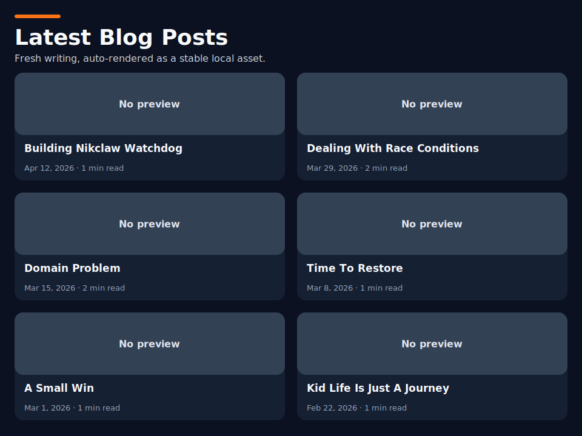
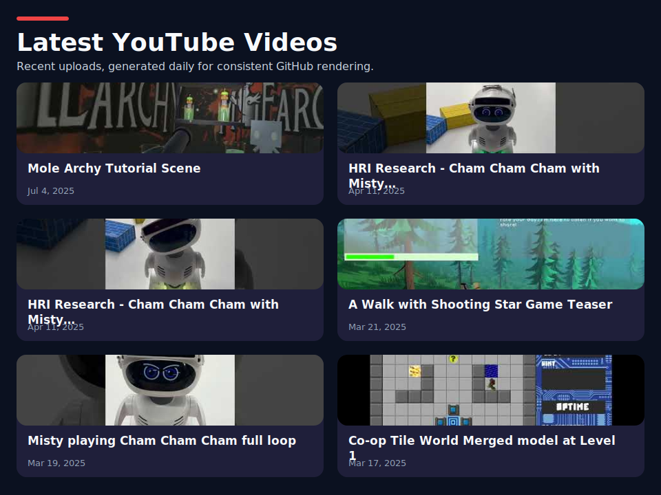
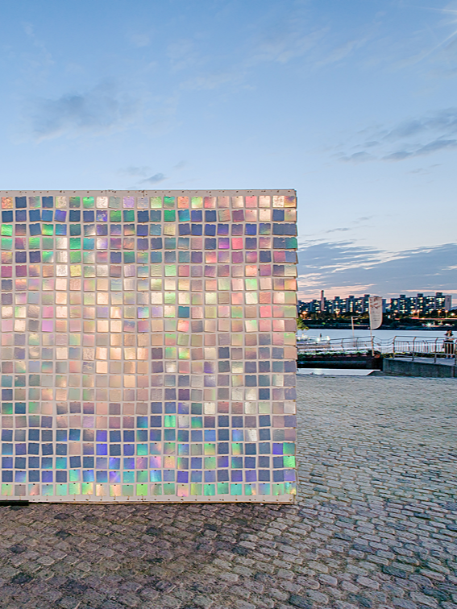
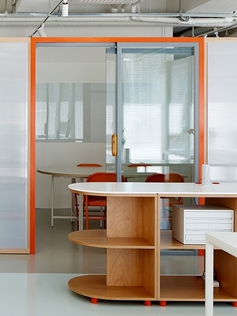
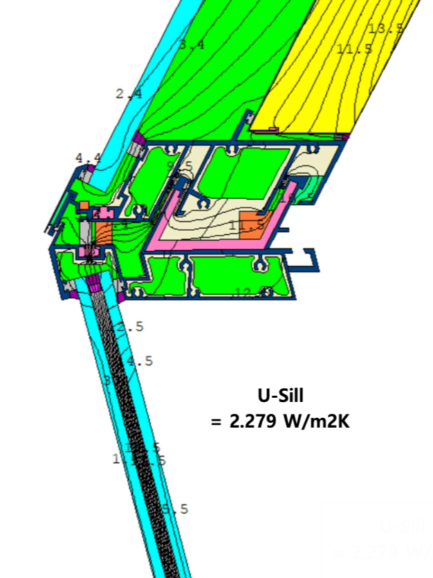

## Hi there I'm Nik 👋

📍 **San Francisco, USA**\
🇰🇷 **Thinker and Builder**\

> I’m an idiosyncratic thinker and builder interested in building systematic harnesses for human-AI cognitive collaboration.

## GitHub Activity

## Projects

- ☀️ **[ai-morning-brief](https://github.com/nik-pgh/ai-morning-brief)** - Daily AI news briefing system that turns raw updates into structured insight without overwhelm.
- 🕺 **[2p_tworld](https://github.com/nik-pgh/2p_tworld)** - Cooperative tile-world experiment, playable in the browser, for shared human-agent interaction.
- 🫧 **[Boba Bubble Trouble](https://globalgamejam.org/games/2025/boba-bubble-trouble-2)** - Two-player 3D platformer from Pittsburgh Game Jam with squishy boba physics, competitive play, and playful level design.
- 🐕 **[A Walk with Shooting Star](https://github.com/nik-pgh/wwss_1.0)** - LLM-powered game companion that uses VR spatial context to support embodied conversation, puzzle-solving, and co-play.
- 🎸 **[Human Machine Guitar Hero](https://github.com/nik-pgh/HumanMachineGuitarHero)** - Cooperative rhythm game research project about machine partners that adapt to a human player’s style and contribution level.
- 📊 **[openclaw-dashboard](https://github.com/nik-pgh/openclaw-dashboard)** - Observability dashboard for agent sessions, events, failures, cron runs, and subagents.
- ⛏️ **[niklaworld](https://github.com/nik-pgh/niklaworld)** - Minecraft world and agent embodiment playground where OpenClaw agents live and collaborate in-world.
- 🧾 **[bill_and_meal](https://github.com/nik-pgh/bill_and_meal)** - Vision-language recipe system that learns from grocery receipt images through distillation.

### Legacy Work

_Descriptions below are based only on commits authored by me._

- 🌉 **[Micropolis](https://github.com/nik-pgh/micropolis)** - Added a mine and gem feature set, then fixed six simulation bugs around zoning messages, start date, bulldozable rubble, station tile swaps, flooding bounds, and underwater wire costs.
- 🔠 **[CharInvaders](https://github.com/nik-pgh/charInvaders)** - Built and polished a Unity 2D shooter, with my commits focused on audio fixes, scoreboard work, ending scene flow, best-record bugs, and play-time tracking.
- 🍁 **[miniMaplestory](https://github.com/nik-pgh/miniMaplestory)** - Built a small Python reimagining of MapleStory with explorable maps, monsters, combat systems, and custom game assets.
- 👩💻 **[JobScrapper](https://github.com/nik-pgh/pyFlaskJobScrapper_ver2)** - Built a Flask-based job scraping prototype with search pages for remote-job sources, plus CSV outputs for role-specific searches.

## Latest Blog Posts

<!-- BLOG-POST-LIST:START -->

- [Building Nikclaw Watchdog](https://nik-pgh.github.io/nik-posts/building-nikclaw-watchdog.html) · Apr 12, 2026 · 1 min read
- [Dealing With Race Conditions](https://nik-pgh.github.io/nik-posts/dealing-with-race-conditions.html) · Mar 29, 2026 · 2 min read
- [Domain Problem](https://nik-pgh.github.io/nik-posts/domain-problem.html) · Mar 15, 2026 · 2 min read
- [Time To Restore](https://nik-pgh.github.io/nik-posts/time-to-restore.html) · Mar 8, 2026 · 1 min read
<!-- BLOG-POST-LIST:END -->

## Latest YouTube Videos

<!-- BEGIN YOUTUBE-CARDS -->

- [Mole Archy Tutorial Scene](https://www.youtube.com/watch?v=EScxKemvqdk) · Jul 4, 2025
- [HRI Research - Cham Cham Cham with Misty Facial Expressions](https://www.youtube.com/shorts/1NW0TAQLL8c) · Apr 11, 2025
- [HRI Research - Cham Cham Cham with Misty Body Movement](https://www.youtube.com/shorts/3ajsBvkAI3I) · Apr 11, 2025
- [A Walk with Shooting Star Game Teaser](https://www.youtube.com/watch?v=8yxIVUvqRyc) · Mar 21, 2025
<!-- END YOUTUBE-CARDS -->

---

### Adventures

### Physical Builder to Digital Builder

<table>
<tr>
<td align="center" width="50%">
   
  <strong>Pavilion Design and Installation</strong> Turning ideas into built form through fabrication and on-site assembly.
</td>
<td align="center" width="50%">
   
  <strong>Spatial and Furniture Design</strong> Designing spaces and objects around how people move, gather, and inhabit a place.
</td>
</tr>
<tr>
<td align="center" width="50%">
   
  <strong>Design Automation and Optimization</strong> Using computational tools to navigate constraints, generate options, and refine decisions.
</td>
<td align="center" width="50%">
   
  <strong>Computational Simulation</strong> Testing behavior digitally before fabrication, installation, or deployment.
</td>
</tr>
</table>

<!--
**nik-pgh/nik-pgh** is a ✨ _special_ ✨ repository because its `README.md` (this file) appears on your GitHub profile.

Here are some ideas to get you started:

- 🔭 I’m currently working on ...
- 🌱 I’m currently learning ...
- 👯 I’m looking to collaborate on ...
- 🤔 I’m looking for help with ...
- 💬 Ask me about ...
- 📫 How to reach me: ...
- 😄 Pronouns: ...
- ⚡ Fun fact: ...
-->
